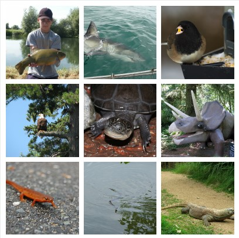

# Reproduction of Momentum Contrast For Unsupervised Visual Representation Learning

Debadeep Basu - 5089107
Ramya Praneetha Ghantasala - 5014212

## Gist of the Paper

The paper presents a novel method called Momentum Contrast or MoCo, in which a dynamic dictionary is implemented with a queue and a moving-averaged encoder. This enables building a large and consistent dictionary on-the-fly that facilitates contrastive unsupervised learning.

## Introduction

Unsupervised representation learning is gaining traction in the fields where the input can be broken down into tokenized items, like words in NLP. When there are tokenized representations available, unsupervised learning can be applied to achieve good results. Tokenized dictionaries like word2vec provide efficient search spaces. On the other hand, in the field of Computer Vision, supervised learning is still dominantly used. A possible reason for this could be that the input stream for a computer vision task cannot be broken down into tokenized items as it is a continuous, high-dimensional input. 

Recent studies have shown that a dynamic dictionary can be built for unsupervised representation learning using contrastive loss. The keys in the dynamic dictionaries are represented by an encoder network and are sampled from data like an image or a patch. The principle of contrastive loss is that when performing a look-up in the dictionary, the matching key should be similar to the encoded query and dissimilar to others. The more similar the key is to the query, the lesser is the contrastive loss. Therefore, it is desirable to build dynamic dictionaries that are large and consistent as they improve during training. The dictionary needs to be large enough to hold the high-dimensional space visual input and should be consistent in the sense that the keys in the dictionary are represented by same or similar encoders to quantitatively compare each of the keys to the query, and such that these comparisons are consistent for all keys.

The paper proposes Momentum Contrast or MoCo as a way to build these kind of dictionaries for unsupervised learning with a contrastive loss. The unique perspective the paper offers is to build the dictionary as a queue of data samples, where the encoded representations of the current mini-batch are enqueued and the oldest are dequeued. In MoCo, a query matches a key if they are encoded views of the same image. In the task of unsupervised visual learning, the network is pre-trained on representations that can be transferred to downstream tasks by fine-tuning. The task of learning representations is called a pretext task, which is the purpose of the MoCo model. A pretext task does not focus on a specific problem but rather focuses on learning good data representations which can then be used by downstream tasks for further learning. In computer vision, a downstream task can be a classification or detection task.  

For this project, we have tried to reproduce the results obtained in the paper by implementing the algorithm as described by the authors of the paper. We have not used any external code and have built the model from scratch. The datasets we have used are detailed in the section below.

The performance of the MoCo network in comparison to current SoTA methods is elaborated in the results section.


## Datasets Used

The paper made use of two very large datasets - ImageNet-1M and the Instagram-1B datasets containing nearly 1 million and 1 billion images respectively. However, due to limited resources and the discontinuation of the support of ImageNet dataset as a part of the torchvision package, we decided to try our model with a wider variety of classification datasets containing fewer images. The datasets we used in our attempts to reproduce the results of the paper are described below:

### ImageNet-mini

The ImageNet-mini dataset consists of about 50,000 images sampled across the 1000 classes of the ImageNet-1M dataset. We used the ImageNet-mini Dataset to perform an initial experiment with the proposed methodology, using a ResNet-50, on a single GPU without making use of Shuffling Batch Normal. The following are some samples from the ImageNet-mini dataset.


*Figure 1: Samples from the ImageNet-mini Dataset*

### MNIST

The MNIST Dataset consists of a total of 70,000 images of size 32 x 32 consisting of handwritten digits split into 10 classes. We used the MNIST dataset during our experiments with the multiprocessed TPU Cores available on Google Colaboratory.

### EMNIST

The E-MNIST or Extended MNIST dataset was used as an alternative large dataset for our experiments as we were unable to obtain the full sized ImageNet-1M and the Instagram-1B datasets due to resource constraints. The E-MNIST dataset builds upon the MNIST dataset and contains over 800,000 images split unevenly between 62 classes in its *by-class* split. We used the EMNIST dataset available as a part of PyTorch's torchvision package to try and reproduce the Momentum Contrastive Learning using Distributed processing on the multi-core TPU.

## Architecture

Consider an encoded query *q*a set of encoded samples {k_0, k_1, k_2, ...}. The MoCo network trains the network by comparing the query to a dictionary of encoded keys. It uses a contrastive loss function, which when given a positive sample belonging to  particular class, calculates its distance to another sample of the same class and compares it with a sample from a negative class. This differs from a traditional loss function where the comparison of a model's prediction is an absolute value. Contrastive learning is recently being used as a foundation in works on unsupervised learning. In the case of MoCo, contrastive learning essentially means that the loss function measures the similarity or dissimilarity of the query and the encoded keys, and attempts to maximize the similarity of the query to a matched key, say k_+. The formula for the contrastive loss function used is given by:


*Figure 2: Contrastive Loss Function*

This loss function is a type of contrastive loss called InfoNCE, where *T* is a temperature hyper-parameter. The instantiations of the query samples depends on the type of pretext task. 

*COMPARISON OF CONTRASTIVE LOSS*

The dictionary is dynamically built on-the-go by a set of data samples like patches or images. The dictionary is built in the form of a dynamic queue, in which the latest mini-batch is enqueued and the oldest mini-batch is dequeued. This way, the size of the dictionary is not dependent on the size of the mini-batch. The dictionary size itself could be independently set as a hyper-parameter. The dictionary keys are encoded by a slowly progressing encoder, which uses a momentum update from the query encoder. This ensures that the dictionary is both large and consistent. The representations learnt from this architecture can be transferred to a downstream tasks like object classification, segmentation, detection. The overhead of maintaining the state of the dictionary is negligible when compared to the benefits given by such an architecture.

The particular pretext task MoCo focuses on is instance discrimination, in which a query and a key are a positive pair if they belong to the same images, else they are a negative pair. The queries and keys can be encoded by any convolutional neural network. Figure 3 shows the basic architecture of the MoCo network.


*Figure 3: Basic Architecture of the Momentum Contrast network*

## Algorithm

The pseudocode for the algorithm is defined as below:

```python
# f_q, f_k: encoder networks for query and key
# queue: dictionary as a queue of K keys (CxK)
# m: momentum
# t: temperature
f_k.params = f_q.params # initialize
for x in loader: # load a minibatch x with N samples
    x_q = aug(x) # a randomly augmented version
    x_k = aug(x) # another randomly augmented version
    q = f_q.forward(x_q) # queries: NxC
    k = f_k.forward(x_k) # keys: NxC
    k = k.detach() # no gradient to keys
    # positive logits: Nx1
    l_pos = bmm(q.view(N,1,C), k.view(N,C,1)) #batch matrix multiplication
    # negative logits: NxK
    l_neg = mm(q.view(N,C), queue.view(C,K)) #matrix multiplication
    # logits: Nx(1+K)
    logits = cat([l_pos, l_neg], dim=1) #concatenation
    # contrastive loss, Eqn.(1)
    labels = zeros(N) # positives are the 0-th
    loss = CrossEntropyLoss(logits/t, labels)
    # SGD update: query network
    loss.backward()
    update(f_q.params)
    # momentum update: key network
    f_k.params = m*f_k.params+(1-m)*f_q.params
    # update dictionary
    enqueue(queue, k) # enqueue the current minibatch
    dequeue(queue) # dequeue the earliest minibatch
```

## Experiments

### Model Creation
We attempted to reproduce the model and method described by the paper. We started out by implementing the algorithm as described in the previous section. Due to the lack of resources, specifically access to multiple-GPU environments, we performed our experiments in two different ways which are explained in the sub-sections below. We used a ResNet-50 architechture up to its penultimate global average pooling layer, replacing the fully connected layer with reduced dimensions to obtain the encoder. For the fully connected layer of the base architecure, the output is equal to our predetermined batch size(128), followed by a normalization of the output layer. The representation obtained here is used as the output of our encoder network. Both the query and key encoders use the same network and produce the same dimensional output.

### Random Image Augmentation
As outlined by the paper, the images used undergo some random augmentations. This was achieved by using the functions readily available under the torchvision transforms package. We used `RandomResizedCrop`, `Random

| Hyperparameters           |        |
|---------------------------|--------|
| Batch Size                | 128    |
| Dictionary Size           | 4096   |
| Momentum(for key encoder) | 0.9    |
| Momentum(for SGD)         | 0.9    |
| Weight Decay              | 0.0001 |
| Learning Rate             | 0.03   |
| Temperature               | 0.07   |

```
Technical details. We adopt a ResNet [33] as the encoder,
whose last fully-connected layer (after global average pooling)
has a fixed-dimensional output (128-D [61]). This output
vector is normalized by its L2-norm [61]. This is the
representation of the query or key. The temperature  in
Eqn.(1) is set as 0.07 [61]. The data augmentation setting
follows [61]: a 224224-pixel crop is taken from a randomly
resized image, and then undergoes random color jittering,
random horizontal flip, and random grayscale conversion,
all available in PyTorch’s torchvision package.
```

### Attempt with a Single GPU

### Moving to TPU
After the GPU proved to be an insufficient resource for the network, we attempted to run it with a TPU processor on Google Colab. This involved significantly changing our existing code to adapt to the multi-processing capabilities of the 8-core TPU. We observed a noticeable difference in the running time of the model as compared to the GPU, but we still could not get any tangible results. We used the ImageNet dataset with a 224x224 crop as recommended by the paper, but this caused the TPU to run out of memory instantly, even before 1 complete epoch could be run. We then moved to a 32x32 crop, with which we were able to run a few epochs but the TPU ultimately ran out of memory. 

## Challenges Faced
Primary challenge: environment with multiple GPU
We tried working on a single GPU using Colab and Kaggle. But as defined in the paper(see Shuffling BN)
batch norm leads to information leakage between batches(which we have seen in a result... Loss not changing after 5 epochs)

Secondary challenge: Adapting the Shuffling code to adapt to TPU with 8 cores

Lower support of Xla by torch compared to distributed GPU backend - torch distributed does not contain any support for "tpu" or "Xla" backend yet, and is also not part of their roadmap at this point. This leads to a number of integral functions such as "torch.distributed.broadcast" to be unavailable to be adapted for the tpu backend - Currently torch.distributed has support for, and recommends only "gloo"(for CPU), and "nccl"(GPU) backends for distributed processing of tensors

Experiments: due to lower processing power, we made some changes to the suggested code from the paper. For instance, the transformation method using ImageNet for Resnet50, expects the image crops to be random crops of 224x224.   We had to use 32x32 to prevent our resources from running out of memory or terminating due to overuse
We changed to a Resnet18 for EMNIST

## Results

## Conclusion

The unique MoCo method proposed in this paper performs comparitively with supervised representation learning and puts forward unsupervised representation learning as a strong contender to traditional supervised learning methods in the field of Computer Vision.
